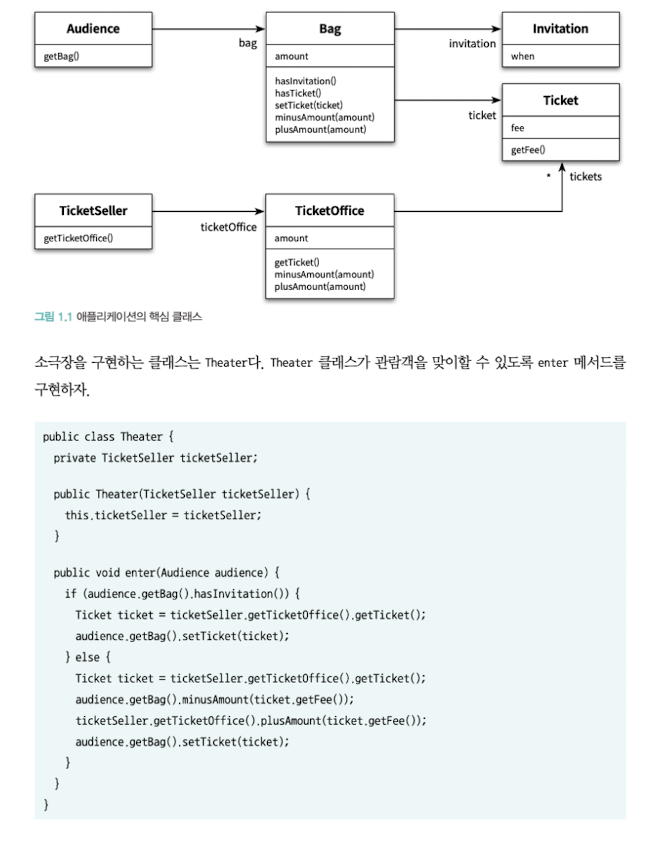

# 1장

# 객체, 설계

## 티켓 판매 애플리케이션 구현하기

극장 이벤트로 인한 초대장 발송 구현

```jsx
public class Invitation {
	private LocalDateTime when;
}
```

```jsx
public class Ticket {
	private Long fee;
	
	public Long getFee() {
		return fee;
	}
}
```

```jsx
public class Bag {
	private Long amount;
	private Invitation invitation;
	private Ticket ticket;

	public boolean hasInvitation() {
		return invitation != null;
	}

	public boolean hasTicket() {
		return ticket != null;
  }

	public void setTicket(Ticket ticket) {
		this.ticket = ticket;
	}

	public void miunusAmount(Long amount) {
		this.amount -= amount;
	}

	public void plusAmount(Long amount) {
		this.amount += amount;
	}
}
```

```jsx
public class Bag {
	public Bag(long amount) {
		this(null,amount);
	}

	public Bag(Invitation invitation, long amount) {
		this.invitation = invitation;
		this.amount = amount;
	}
}
```

```jsx
public class Audience {
	private Bag bag;
	
	public Audience(Bag bag) {
		this.bag = bag;
	}

	public Bag getBag() {
		return bag;
	}
}
```

```jsx
public class TicketOffice {
	private Long amount;
	private List<Ticket> tickets = new ArrayList<>();
	
	public TicketOffice(Long amount, Tiekct ... tickets) {
		this.amount = amount;
		this.tickets.addAll(Arrays.asList(tickets));
	}
	
	public Ticket getTicket() {
		return tickets.remove(0);
	}
	
	public void minusAmount(Long amount) {
		this.amount -= amount;
	}
	
	public void plusAmount(Long amount) {
		this.amount += amount;
	}

}
```

```jsx
public class TicketSeller {
	private TicketOffice ticketOffice;

	public TicketSeller(TicketOffice ticketOffice) {
		this.ticketOffice = ticketOffice;
	}

	public TicketOffice getTicketOffice() {
		return ticketOffice;
	}
}
```



## 무엇이 문제인가

소프트웨어 모듈이 가져야 하는 세가지 가능

1. 재대로 동작해야 한다.
2. 변경을 위해 존재한다.
   1. 생명주기 동안 변경되므로 간단한 작업만으로 변경이 가능해야 한다.
3. 코드를 읽는 사람과 의사소통이 가능해야 한다.

위 코드는 변경이 간단하지 않고, 의사소통이 불가능하다.

## 예상을 빗나가는 코드

문제는 관람객과 티켓 판매원이 소극장의 통제를 받는다.

두 대상은 소극적으로 누군가 자신의 가방을 열어 돈을 확인하거나, 티켓을 관람객의 가방에 그냥 집어 넣는 것을 허락하거나 표에 대한 판매액을 극장이 마음대로 만질 수 있게 한다는 것이다.

이해 가능한 코드는 의사소통을 크게 벗어나지 않는 코드다.

위 코드들은 안타깝게도 우리의 예상을 벗어나서 동작하므로 재대로 의사소통 할 수 없다.

코드를 이해하는데 어려움을 주는 요소 중 또 하나는 모든 클래스들을 동시에 기억하고 있어야 하기 때문이다.

하나의 클래스나 메서드에서 너무 많은 세부사항을 다루기 때문에 부담을 준다.

## 변경에 취약한 코드

제일 큰 문제점은 Audience 나 TicketSeller를 변경하는 경우에 Theater도 함께 변경해야 한다는 사실이다.

위 코드에서 관람객은 현금과 초대장을 보관하기 위해 가방을 항상 들고다니고 판매원은 매표소에서만 티켓을 판매한다고 가정한다.

추가적인 요구사항이 들어올 때 코드가 모두 수정에 대상이 된다.

관람객이 가방을 들고 있다는 가정이 바뀌면 Audience 클래스에서 Bag를 제거해야 하며 Audience에 가방에서 직접 Ticket을 꺼내는 Theater도 변경되어야 한다.

**이처럼 세부사항이 한 가지라도 바뀌면 클래스 뿐만 아니고 클래스에 의존하는 클래스도 함께 변경해야 한다.**

이것은 객체 사이의 의존성과 관련된 문제이다.

의존성 자체가 변경에 대한 암시를 주고 있지만 없애는 것이 답이 아닌 최소한의 의존성만 유지하는 것이 답이다.


객체 사이의 의존성이 과한 경우 결합도(coupling)가 높다고 표현한다.

두 객체 사이의 결합도가 높을수록 함께 변경될 확률이 높아진다. 따라서 **설계의 목표는 객체 사이의 결합도를 낮춰**

**변경이 용이한 설계를 만드는 것이다.**

### 설계 개선하기

변경과 소통은 함께 얽혀있다. 극장이 직접 관객의 가방과 매표소에 접근하기 때문에 문제는 발생한다.

스스로 행동하는 관객과 판매원이라는 직관에서 벗어나기 때문이다.

극장이 관람객의 가방과 판매원의 매표소에 직접 접근한다는 것은 극장과 관람객, 극장과 판매원이 결합되었다는 의미다.

해결 방법은 간단하게 극장이 관객과 판매원에 대한 세세한 부분을 알지 못하게 하면 된다.

다시말해 관람객과 판매원을 자율적인 존재로 만들면 되는 것이다.

### 자율성을 높이자

설계 변경의 어려움은 극장이 판매원의 티켓오피스와 관람객의 가방까지 직접 접근할 수 있기 때문이다.

해결 방법은 관람객이 직접 가방을 처리하고, 판매원이 직접 티켓오피스를 처리하는 자율적인 존재가 되도록 변경하는 것이다.

극장이 직접 판매원의 티켓오피스에 접근할 수 없도록 하고, 판매원이 자율성을 갖고 티켓오피스를 처리하는 방식으로 변경한다.


```jsx
public class TicketSeller {
	private TicketOffice ticketOffice;

	public TicketSeller(TicketOffice ticketOffice) {
		this.ticketOffice = ticketOffice;
	}
	
	public void sellTo(Audience audience) {
		if(audience.getBag().hasInvitation()) {
			Ticket ticket = ticketOffice.getTicket();
			audience.getBag().setTicket(ticket);
		} else {
			Ticket ticket = ticketOffice.getTicket();
			audience.getBag().minusAmount(ticket.getFee());
			ticketOffice.plusAount(ticket.getFee());
			audience.getBag().setTicket(ticket);
		}
	}

}
```

판매원 클래스에서 getTicketOffice 메서드가 제거되고 private으로 접근이 불가능하여 외부에서 직접 접근할 수 없다. 오직 티켓판매원이 제공하는 메서드를 통해 접근이 가능하다.

**이처럼 개념,물리적으로 객체 내부의 세부적인 사항을 감추는 것을 캡슐화라고 한다.**

캡슐화의 목적은 변경하기 쉬운 객체를 만드는 것이다. 객체 내부로의 접근을 제한하면 객체 사이에 결합도를 낮출 수 있다.


수정된 극장 클래스에서는 더 이상 티켓오피스에 접근하지 않고, 판매원이 티켓오피스를 가지고 있다는 사실을 알 수 없다.

극장은 판매원이 제공하는 인터페이스에만 의존한다. 판매원의 내부 구현에 대해서는 알지 못한다.

**객체를 구현과 인터페이스로 나누고 인터페이스만을 공개하는 것이 객체 사이의 결합도를 낮추는 기본적인 설계원칙이다.**


극장의 로직을 판매원으로 옮긴 후, 극장에서 티켓오피스에 대한 의존성이 제거되었단 것을 알 수 있다.

티켓오피스와 협력하는 판매원의 내부 구현이 성공적으로 캡슐화 된 것이다.

극장에 대한 관람객의 의존성은 여전히 존재하고 가방에 대한 의존성은 극장에서 사라졌지만 판매원에게 이동되었다.

티켓 판매원이 고객의 가방을 여는 것이 아닌, 협력관계에 있는 고객이 직접 가방을 열고, 가방에 접근하는 인터페이스를 제공해야 한다.


관람객은 가방에 초대장이 있는지 스스로 확인하고, 외부에 가방을 노출하지 않는다.

구현을 숨기고 buy라는 인터페이스를 노출해 캡슐화를 하고 결합도를 낮췄다.

판매원은 더 이상 관람객의 가방에 접근할 수 없고, 관람객이 제공하는 인터페이스를 통해 의사소통한다.

관람객은 구현을 숨겼기 때문에 내부 구현이 변경되어도 판매원은 동일한 인터페이스로 접근하여 의사소통하므로

변경에 영향을 받지 않는다.

## 무엇이 개선되었는가


관람객과 판매원이 자율적인 존재로 변경된 모습이다. 소프트웨어의 모듈을 만족하는 조건 중,

의사소통이 되어야 한다는 점과, 변경에 용이하다는 점을 만족했다.

## 캡슐화와 응집도

핵심은 객체 내부의 구현을 숨기고, 인터페이스를 통해 상호작용하는 캡슐화를 진행한 것이다.

**밀접하게 연관된 작업만을 수행하고 연관성 없는 작업은 연관성을 갖는 객체에게 위임하는 것을 가리켜**

**응집도가 높다고 말한다.**

응집도를 높이기 위해서는 객체 스스로 자신의 데이터를 책임져야 한다.

## 절차지향과 객체지향

수정 전 극장의 enter 메서드를 보면 판매원으로 부터 가방과 티켓오피스를 가져와 관램객을 입장 시키는 절차를 구현했다.

관람객, 판매원, 가방, 티켓오피스는 관람객을 입장시키는데 필요한 정보를 제공하고 모든 처리는 극장이 했다.

위 관점에서 극장의 enter 메서드는 프로세스이며, 각각의 나머지 객체들은 데이터 역할을 한다.

**이렇게 프로세스와 데이터를 별도의 모듈에 위치시키는 방식을 절차지향적 프로그래밍이라고 한다.**

프로세스를 가진 객체는 데이터를 제공하는 객체가 변경되면 함께 변경될 수 밖에 없다. 데이터에 의존하기 때문이다.

**반대로 데이터와 프로세스가 동일한 모듈 내부에 위치하도록 프로그래밍 하는 방식을 객체지향적 프로그래밍이라고 한다.**

## 책임(기능)의 이동

객체의 책임은 곧 기능이라고 말 할 수 있다. 극장의 문제점은 많은 책임(기능)을 가지고 있다는 것이다.


과도한 책임(기능)을 제공하는 극장에서 각 객체가 프로세스를 제공하여 책임을 분산 시켰고, 그렇게 하여

객체의 프로세스와 데이터가 같은 위치에 존재하게 되고, 캡슐화가 잘 이뤄졌고, 응집도가 높아지고 결합도가 낮아지며 변화에 유연한 설계가 되었다.

## 더 개선할 수 있다.

관람객을 보면, 가방의 데이터에 직접 접근하지 않지만, 가방의 데이터를 직접적으로 변경하는 메서드를 호출하고있다.

가방의 내부 데이터를 변경하는 프로세스를 가방에 추가하고, 관람객은 가방의 인터페이스를 통해 접근하면 응집도를 높히고 결합도를 낮출 수 있다.


가방은 hold 인터페이스를 제공해 내부 상태를 변경하고, 관람객은 가방의 인터페이스를 통해 가방의 상태를 변경한다.

판매원 역시 티켓오피스의 데이터를 거의 직접적으로 변경한다.

티켓오피스에게도 동일한 방식으로 자율권을 찾아준다.


하지만 이렇게 변경한 후에 티켓판매처와 고객 사이에 결합이 생겨버렸다.


결합도가 생긴것에 대한 대처로 개발팀은 티켓오피스에 대한 관객의 의존성을 제거하고, 기존처럼 티켓오피스의 자율성을 낮췄다.

이렇게 설계의 방식은 여럿이 될 수 있으며 결국 설계는 트레이드오프의 산물이다.

의사소통의 관점에서는 극장이나 판매처, 가방 등이 스스로 자율적인 존재라는 것은 말이 안되지만

소프트웨어의 입장에서는 각 객체가 스스로 생각하고 행동하도록 설계를 해야한다.