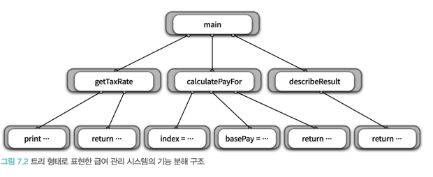
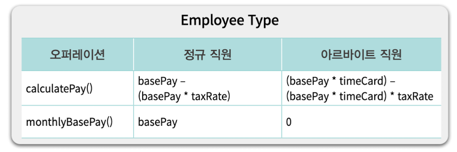
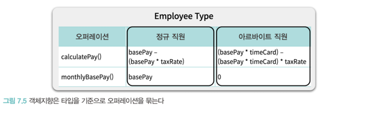
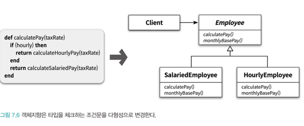

# 객체 분해

---

# 목차

---

# 들어가는 말

사람의 기억은 **단기 기억** 과 **장기 기억** 으로 나뉜다.

**장기 기억** 은 수개월에서 평생을 걸쳐 보관하는 저장소를 말한다.

장기 기억은 무한대에 이르는 저장공간과 직접 접근하는 것이 불가능하고 단기 기억 영역으로 옮긴 후 처리된다.

이에 반해 **단기 기억** 은 직접 접근할 수 있지만 보관할 수 있는 공간과 속도 측면에서 모두 제약을 받는다.

[조지 밀러](https://ko.wikipedia.org/wiki/%EC%A1%B0%EC%A7%80_%EC%95%84%EB%AF%B8%ED%8B%B0%EC%A7%80_%EB%B0%80%EB%9F%AC)에 이론에 따르면 공간적인 제약은 매직넘버인 7로 널리 알려져 있다.

사람이 동시에 단기 기억 안에 저장할 수 있는 정보의 개수는 5에서 많아야 9개 사이라는 것이다.

또한 하버트 사이먼에 따르면 사람이 새로운 정보를 받아들이는데 5초 정도의 시간이 소요 된다고 한다.

컴퓨터는 시간과 공간의 트레이드오프를 통해 효율을 올릴 수 있지만 사람은 그렇지 않다.

사람의 단기 기억에 있어 시간과 공간의 두 측면 모두가 병목지점이 되버린다.

> 핵심은 실제로 문제를 해결하기 위해 사용하는 저장소는 단기 기억이라는 것이다. 문제를 해결하기 위해서는 필요한 정보들을 먼저 단기 기억으로 로드해야 한다.
> 
> 그러나 문제 해결을 위한 정보가 단기 기억의 용량을 초과하는 순간이 오고 효율은 엄청나게 떨어지는데 이를 **인지 과부하** 라고 한다.

---

인지 과부하를 막기 위해서는 단기 기억안에 저장할 내용을 조절해야 한다.

본질적인 것만 놔두고 세부 사항을 걸러내면 문제는 단순해진다. 이를 **추상화** 라고 한다.

가장 일반적인 추상화 방법은 한 번에 다뤄야 하는 문제의 크기를 줄이는 것이다. 이를 분해라고 한다.

분해의 목적은 큰 문제를 인지 과부하의 부담 없이 단기 기억 안에서 처리할 수 있게 나누는 것이다.

한 번에 단기 기억에 담을 수 있는 추상화의 수는 한계가 있지만, 더 큰 추상화로 압축할 수 있다.

> 복잡성이 존재하는 곳에서 추상화와 분해를 통해 해결할 수 있다.

---

# 프로시저 추상화와 데이터 추상화
프로그래밍 언어의 발전은 추상화를 통해 복잡성을 극복하는데서 이뤄졌다.

어셈블리어에서 인간이 이해할 수 있는 고수준 언어가 나왔다. 인간에 눈 높이에 맞는 추상화를 제공하는 것이다.

프로그래밍 언어를 통해 표현되는 추상화의 발전은 다양한 패러다음의 탄생으로 이어졌다.

프로그래밍 패러다임은 프로그래밍을 구성하기 위해 사용하는 추상화의 종류와 이 추상화를 이용한 소프트웨어를 분해하는 두 가지 요소로 결정된다.

> 모든 프로그래밍 패러다임은 추상화와 분해의 관점에서 설명할 수 있다.
> 

---

현대적인 프로그래밍 언어를 특정 짓는 두 가지 중요한 매커니즘은 **프로시저 추상화** 와 **데이터 추상화** 이다.

* 프로시저 추상화는 소프트웨어가 무엇을 해야 하는지를 추상화 한다.
* 데이터 추상화는 소프트웨어가 무엇을 알아야 하는지를 추상화 한다.

> 소프트웨어는 데이터를 이용해 정보를 표현하고 프로시저를 통해 데이터를 조작한다.

따라서 현대의 중요한 프로그래밍 패러다임은 프로시저 추상화나 데이터 추상화를 중심으로 시스템의 분해 방법을 설명한다.

---

시스템을 분해하려면 프로시저 추상화를 할지, 데이터 추상화를 할지 결정해야 한다.

프로시저 추상화를 중심으로 시스템을 분해하면 **기능 분해** 가 이뤄진다.

데이터 추상화를 중심으로 시스템을 분해 할 때, 하나는 데이터를 중심으로 **타입을 추상화** 하는 것이고, 다른 하나는 데이터를 중심으로

**프로시저** 를 추상화 한다. 

> 전자를 **추상 데이터 타입** 이라고 하고, 후자를 **객체 지향** 이라고한다.

---

지금까지 객체지향 패러다임을 역할과 책임을 수행하는 자율적인 객체들의 협력 공동체를 구축하는 것으로 서령했다.

여기서 '역할과 책임을 구행하는 객체'가 바로 객체지향 패러다임이 이용하는 추상화이다.

---

프로그래밍 언어 관점에서 객체지향은 기능을 구현하기 위해 필요한객체를 식별하고 협력 가능하도록 시스템을 분해한 후 프로그래밍 언어라는

수단을 이용해 실행 가능한 프로그램을 구현하는 것이다.

프로그래밍 언어에서 객체지향이란 데이터를 중심으로 데이터 추상화와 프로시저 추상화를 통합한 객체를 이용해 시스템을 분해하는 방법이고, 

클래스를 통해 구현한다.

> 따라서 프로그래밍 언어적인 관점에서 개게지향을 바라보는 일반적인 관점은 데이터 추상화와 프로시저 추상화를 함께 포함한 클래스를 사용해
> 
> 시스템을 분해하는 것이다.

---

# 프로시저 추상화와 기능 분해
## 메인 함수로서의 시스템

기능과 데이터 중 뭘 기준으로 소프트웨어를 **분해** 해야 할까?

처음에는 기능을 중심으로 분해하는게 유행이었다.

프로시저는 반복/유사하게 실행되는 작업들을 한 장소에 모아놓음으로써 재사용성이 높아지고 중복을 막는 추상화 이다.

내부 구현을 몰라도 인터페이스만 알면 사용할 수 있기 때문에 추상화라 부르고 정보 은닉도 가능하지만 한계를 후에 서술한다.

---

소프트웨어 분해에서 프로시저 중심은 수학의 함수와 같다.

> 시스템은 필요한 더 작은 작업으로 분해될 수 있는 하나의 커다란 메인함수이다.

전통적인 기능분해 방법은 **하향식 접근법** 이 있다.

시스템을 구성하는 최상위를 정의하고, 최상위 기능을 좀 더 작은 단위의 시스템으로 계속 분해하는 것이다.

프로그램 언어로 구현되는 수준까지 나누며, 상위 프로그램은 하위프로그램보다 더 추상화되어있다.

---

## 급여 관리 시스템
연초에 회사는 매달 지급해야 하는 기본급에 대해 직원과 협의하며 이 금액을 12개월 동안 동일하게 직원들에게 지급한다.

회사는 급여 지급 시, 소득세율에 따라 일정 금액의 세금을 공제한다. 

~~~
급여 = 기본급 - (기본급 * 소득세율)
~~~

여기서 하향식 접근법을 사용해본다.

시스템을 정의하는 하나의 문장을 만들고, 이 문장을 좀 더 작은 기능으로 분해하면 된다.

먼저 급여 관리 시스템에 대한 최상위 문장을 만들어 보자.

~~~
직원의 급여를 계산한다.
~~~

이제 좀 더 세분화 해보자.

~~~
직원의 급여를 계산한다.
    사용자로부터 소득세율을 입력받는다.
    직원의 급여를 계산한다.
    양식에 맞게 결과를 출력한다.
~~~

구체적이고 단순한 문장으로 분해할수 없을 때 까지 분해한다.

직원의 급여를 계산하기 위해서 소득세율 뿐만 아니라 직원의 기본급 정보도 필요하다.

이를 위해 직원에 대한 기본급 데이터를 시스템 내부에 보관하기로 했다.

마지막으로 급여 계산 결과를 출력하기로 결정했다.

~~~
직원의 급여를 계산한다.
    사용자로부터 소득세율을 입력받는다.
        "세율을 입력하세요: " 라는 문장을 화면에 출력한다.
        키보드를 통해 세율을 입력 받는다.
    직원의 급여를 계산한다.
        전역 변수에 저장된 직원의 기본급 정보를 얻는다.
        급여를 계산한다.
    양식에 맞게 결과를 출력한다.
        "이름 : $직원명, 급여 : $계산된 금액" 형식에 따라 출력한다.
~~~

기능 분해에서 급여 관리시스템을 커다란 메인 함수로 간주하고, 기능 분해를 시작했다.

각 분해된 단계는 시간에 흐름에 따른 절차이며, 각 하위 목록이 기능으로 분해된다.

---

여기서 입력 정보는 직원정보와 소득세율이고 출력정보는 계산된 급여이다.

기능 분해 방법은 기능을 중심으로 필요한 데이터를 결정한다.

기능이 최우선이고, 이 기능을 정제하고 분해하는 과정에서 필요한 데이터의 종류와 저장 방식을 식별한다.

이는 유지보수에 문제를 일으킨다.

뭐가 문제일까?

---

## 급여 관리 시스템 구현

기능 분해를 했으니까 코드로 옮겨보자.

~~~
직원의 급여를 계산한다.
~~~

~~~
def main(name)
end
~~~

---

~~~
직원의 급여를 계산한다.
    사용자로부터 소득세율을 입력받는다.
    직원의 급여를 계산한다.
    양식에 맞게 결과를 출력한다.
~~~

~~~
def main(name)
    taxRate = getTaxRate()
    pay = calculatePayFor(name, taxRate)
    puts(describeResult(name, pay))
end
~~~

~~~
def getTaxRate()
    print("세율을 입력하세요 : ")
    rturn gets().chomp().to_f()
end
~~~

프로그램 내부에 급여 계산을 위한 직원의 이름과 기본급을 선언한다.

~~~
$employees = ["직원A", "직원B", "직원C"]
$basePays = [400, 300, 250]
~~~

~~~
def calculatePayFor(name, taxRate)
    index = $employees.index(name)
    basePay = $basePay[index]
    return basePay - (basePay * taxRate)
end
~~~

~~~
def describeResult(name, pay)
    return "이름 : $name, 급여 : $pay
end
~~~

직원 C의 급여를 계산하려면 아래와 같이 호출한다.

~~~
main("직원C")
~~~

하향식 기능 분해 방식으로 설계한 시스템은 메인 함수를 구성하는 하나의 루트와 각 프로시저를 노드로 표현할 수 있다. (트리)

현실은 이렇게 체계적이고 이상적이지 않다. 

---

## 하향식 분해의 문제점
>
>
>1. 시스템은 하나의 커다란 함수로 이뤄져 있지 않다.
>
>2. 기능 추가나 요구사항 변경으로 인해 메인 함수를 빈번하게 수정해야 한다.
>
>3. 비지니스 로직이 인터페이스와 강하게 결합된다.
>
>4. 하향식 분해는 너무 이른 시기에 함수들의 실행 순서를 고정시키기에 유연성과 재사용성이 떨어진다.
>
>5. 데이터형식이 변경될 경우 파급 효과를 예측할수 없다.
>

하나씩 조져보자

### 하나의 메인함수라는 비현실적인 아이디어
지금은 괜찮은데 요구조건이 추가되면서 최상위는 추가로 최상위를 갖게 되고, 같은 레벨의 요구조건이 생긴다.

즉, top이었던 기능은 시간이 지나면서 top이 아니게 된다.

하향식 접근법은 하나의 알고리즘을 구현하기에는 적합하지만 현대적인 상호작용 시스템을 개발하는데는 적절하지 않다.

현대적인 시스템은 동등한 수준의 다양한 기능으로 구성된다.

### 메인 함수의 빈번한 재설계
직원들의 급여 총액을 계산 해달라는 요구사항이 생겼다.
현재 하나의 main으로는 껴 넣을 곳이 없다.

기존에 main 함수를 calculatePay라는 함수로 바꾸고, 새로운 기능을 추가한다.
~~~
def main(operation, args={})
    case(operation)
    when :pay then calculatePay(args[:name])
    when :basePays then sumOfBasePays()
    end
end
~~~

시스템이 여러 개의 정상으로 구성되기 때문에 새로운 요구사항이 생길 때 마다 main 함수를 변경 할 수 밖에 없다.

정상을 바꿀 때 마다, 하나의 정상이라고 간주했던 main의 구현을 바꿀 수 밖에 없다. 변경은 버그 발생 확률을 높이기 때문에 취약해진다.

---

### 비지니스 로직과 사용자 인터페이스의 결합
하향식 접근법은 비즈니스 로직을 설계하는 초기 단계부터 입력 방법과 출력 양식을 함께 고민하도록 강요한다.

"사용자로부터 소득세율을 입력받아 급여를 계산한 후 계산된 결과를 화면에 출력한다" 라는 중요한 비지니스 로직과 소득세율을 입력받아 출력하는

인터페이스 부분까지 한데 섞여 있다.

결과적으로 코드 안에서 비지니스 로직과 사용자 인터페이스 로직이 밀접하게 결합된다.

---

### 성급하게 결정된 실행 순서
커다란 메인 함수를 계속 분해했기 때문에 시간 순서대로 코드가 작성되고, 시스템이 무엇을 해야 하는가 가 아니라

어떻게 동작해야 하는지에 집중하도록 설계되었다.

what 이 아니라 how를 먼저 생각한다.

어떻게 할것인가를 생각하기 때문에 함수들의 순서를 결정해야 하고, 분기, 반복과 같은 제어 구조를 미리 결정하지 않고는 분해를 진행할 수 없다.

결과적으로 모든 중요한 제어 흐름의 결정이 상위 함수에서 이뤄지고 하위 함수는 상위 함수의 흐름에 따라 적절한 시점에 호출된다.

문제는 중요한 설계 결정사항인 함수의 제어 구조가 빈번한 변경의 대상이라는 점이다.

기능이 추가되거나 변경 될 때마다 초기 결정된 함수들의 제어 구조가 올바르지 않다는 것이 판명되고 변경이 이뤄져야 한다.

---

이를 해결하는 방법은 논리적 제약을 설계의 기준으로 삼는 것이다.

함수간 호출 순서가 아니고 객체 사이의 논리적 관계를 중심으로 설계를 이끌어 나간다. 이렇게 되면 중앙 집중식이 아닌 각 객체가

제어 주체가 되어 분산된다.

하향식 접근법을 통해 분해된 함수들은 또한 상위 함수의 맥락에서 식별되기 때문에 재사용성이 없다.

모든 문제의 원인은 결합도 이다.

상위 함수에 대해 하위 함수들이 강력하게 결합되어 있기 때문에 사소한 변경으로도 전체 시스템을 요동치게 할 수 있다.

---

### 데이터 변경으로 인한 파급효과
하향식 기능 분해의 가장 큰 문제점은 어떤 함수가 어떤 데이터를 쓰는지 추적이 힘들다는 점이다.

따라서 데이터를 변경하면 어떤 함수가 영향을 받을지 예상하기 어렵다.

함수 하나만 보면 쉬울 수도 있는데 전체적으로 보면 파악하기 힘들다. 어떤 함수가 어떤 데이터에 의존하는지 찾으려면

데이터를 참조하는 모든 함수를 열어봐야하기 때문이다.

---

단순히 텍스트 찾기의 문제가 아니라 결합도의 문제이다. 데이터 변경으로 인한 영향은 데이터를 직접 참조하는 모든 함수에 영향을 끼치고

하나하나 다 변경에 대한 조사를 해야 한다.

---

취약함을 증명하기 위해 급여 관리 시스템에 새로운 기능을 추가해본다. 정규 직원 뿐만 아니고 아르바이트생에 대한 급여 역시 계산하게 해달라는 요청이 왔다.

알바의 이름과 시급 역시 기존 변수에 추가하기로 하고, 알바 여부를 묻는 값을 추가했다.

~~~
$employees = [직원A, 직원B, 직원C, 알바D, 알바E, 알바F]
$basePay = [400,300,250,1,1,1.5]
$hourlys = [false, false, false, true, true, true]
~~~

알바의 한 달 업무 누적 시간도 관리한다. 정규직은 0이다.

~~~
$timeCards = [0,0,0,120,120,120]
~~~

이제 데이터를 바꿨으니 해당 데이터를 직접 참조하는 함수들도 찾아서 바꿔줘야 한다.

전체를 파악해서 바꿔야 하는데 실수로 하나를 누락하는 일이 빈번하게 일어나게 된다.

해당 예제를 통해 말해주는 것은 데이터 변경으로 발생하는 함수에 대한 영향도를 파악하는 일은 어렵다는 것이다.

어떻게 하라고 그래서?

---

데이터 변경으로 인한 영향을 최소화 하려면 데이터와 함께 변경되는 부분과 그렇지 않은 부분을 명확하게 분리해야한다.

데이터와 함께 변경되는 부분을 하나의 구현 단위로 묶고 외부에서는 제공되는 함수만 이용해 데이터에 접근해야 한다.

즉, 잘 정의된 인터페이스를 통해 데이터에 대한 접근을 통제해야 하는 것이다.

이를 통해 **정보은닉** 과 **모듈** 이라는 개념이 생겨났다.

---

### 언제 하향식 분해가 유용한가?
커다란 시스템에선 안 유용하다. 그것만 알고있자...

작은 프로그램이나 개별 알고리즘에서는 유용하다...

이미 해결된 알고리즘을 문서와 하는데는 유용하다...

# 모듈
시스템 변경의 기본적인 전략은 함께 변경되는 부분을 하나의 구현 단위로 묶고, 퍼블릭 인터페이스를 통해 접근하도록 하는 것이다.

즉, 기능을 기반으로 시스템을 분해하는 것이 아니라 변경에 방향에 맞춰 시스템을 분해하는 것이다.

---

정보은닉은 시스템을 모듈 단위로 분해하기 위한 기본 원리로 자주 변경되는 부분을 상대적으로 덜 변경되는 인터페이스 뒤로

감춰야 한다는 것이 핵심이다.

정보 은닉은 외부에 감춰야 하는 비밀에 따라 시스템을 분할하는 모듈 분할 원리이다.

뭘 은닉 해야 하는가?

> 1. 복잡성 : 모듈이 너무 잡한 경우 사용자가 이해하기 어렵다. 외부에 모듈을 추상화 할 수 있는 간단한 인터페이스를 제공해서 복잡도를 낮춘다.
> 
> 2. 변경 가능성 : 변경 가능한 설계 결정이 외부에 노출될 경우 실제로 변경이 발생했을 때 파급효과가 커진다. 변경 발생 시,
> 하나의 모듈만 수정하면 되도록 변경 가능한 설계 결정을 모듈 내부로 감춰라.
> 

급여 관리 시스템을 바꿔보자.

---

위에 따라 급여 관리 시스템도 함께 사용되는 데이터를 모듈로 함께 만들어 본다.

급여 관리 시스템에서 외부로 감춰야 하는 비밀은 직원 정보와 관련된 것들이다. 따라서 모듈을 이용해 직원 정보는 내부로 감추고 외부에는 퍼블릭

인터페이스만 노출한다.

~~~
module Employees
    $employees = [직원A, 직원B, 직원C, 알바D, 알바E, 알바F]
    $basePay = [400,300,250,1,1,1.5]
    $hourlys = [false, false, false, true, true, true]
    $timeCards = [0,0,0,120,120,120]
    
    def Employees.calculatePay(name, taxRate)
        if (Employees.hourly?(name)) then
            pay = Employees.calculateHourlypayFor(name, taxRate)
        else
            pay = Employees.calculatePayFor(name, taxRate)
        end
    end
    
    def Employees.hourly?(name)
        return $hourlys[$employees.index(name))]
    end
    
    def Employees.calculatehourlypayFor(name, taxRate)
        index = $employees.index(name)
        basePay = $basePays[index] * $timeCards[index]
        return basePay - (basePay * taxRate)
    end
    
    def Employees.calculatePayFor(name, taxRate)
        return basePay - (basePay * taxRate)
    end
    
    def Employees.sumOfBasePays()
        result = 0
        for name in $employees
            if (not Employees.hourly?(name)) then
            result += $basepay[$employees.index(name)]
            end
        end
        return result
    end
end
~~~

~~~
def main(operation, args={})
    case(operation)
    when :pay then calculatePay(args[:name])
    when :basePays then sumOfBasePays()
    end
end

def calculatePay(name)
    taxRate = getTaxRate()
    pay = Employees.calculatePay(name, taxRate)
    puts(describeResult(name, pay))
end

def getTaxRate()
    print("세율을 입력하세요 : ")
    return gets().chomp().to_f()
end

def describeResult(name, pay)
    return "이름 : #{name}, 급여 : #{pay}:
end

def sumOfBasePays()
    puts(Employees.sumOfBasePays())
end

~~~
           
전역변수였던 값들을 모두 모듈 안으로 숨겼다. 이제 외부에서는 직원 정보를 관리하는 데이터에 직접 접근할 수 없고 퍼블릭 인터페이스를 통해서만 접근 가능하다.

---

## 모듈의 장점과 한계

위 예제를 통한 장점은 아래와 같다.

1. 모듈 내부의 변수가 변경되더라도 모듈 내부에서만 영향을 미친다.
2. 비즈니스 로직과 사용자 인터페이스에 대한 관심사가 분리되었다.
   1. 사용자 입력과 화면 출력을 모듈이 아닌 외부에둿다는 점을 주목하라. 수정된 코드에서 모듈은 비즈니스 로직과 관련된관심사만을 담당한다.
3. 전역 변수와 전역 함수가 제거됨으로써 네임스페이스 오염을 방지한다.

눈여겨 봐야 할 부분은 모듈이 정보 은닉이라는 개념을 통해 데이터라는 존재를 설계의 중심 요소로 부각시켰다는 것이다.

모듈에 있어서 핵심은 데이터이다. 메인 함수를 정의하고 필ㅇ에 따라 더 세부적인 함수로 분해하는 하향식 기능 분해와 달리 모듈은 감춰야 할

데이터를 결정하고 이 데이터를 조작하는 데 필요한 함수를 결정한다.

즉, 데이터를 중ㅅ임으로 시스템을 분해하는 것이다.

모듈은 데이터와 함수가 통합된 한 차원 높은 추상화를 제공하는 설계 단위이다.

---

모듈이 프로시저 추상화보다는 높은 추상화 개념을 제공하지만 태생적으로 변경을 관리하기 위한 구현 기법이기 때문에 추상화 관점에서 한계점이 명확하다.

모듈의 가장 큰 단점은 인스턴스 개념을 제공하지 않는다는 점이다. 더 높은 수준의 추상화를 위해서는 직원 전체가 아니라 개별 직원을 독립적인 단위로 

다룰 수 있어야 한다. 다시 말해서 다수의 직원 인스턴스가 존재하는 추상화 매커니즘이 필요한 것이다.

이를 만족하기 위해서 등장한 개념이 바로 추상 데이터 타입이다.

# 데이터 추상화와 추상 데이터 타입
## 추상 데이터 타입
타입이란 변수에 저장할 수 있는 데이터의 종류를 뜻한다. 타입을 보고 변수가 어떻게 연산에 쓰일 것임을 예측할 수 있다.

프로그래밍 언어는 수 많은 내장 타입을 제공한다. 기능 분해의시대에는 새로운 타입을 추가하는 일이 힘들었다. (제한적이거나 불가능)

---

프로시저 추상화의 한계가 드러나고 데이터 추상화의 개념이 생겨났다.

기존에 직원의 급여를 계산한다 라는 커다란 절차에서 직원과 급여 라는 추상적인 개념들이 생겨나고 협력해서 절차를 이룬다.

추상 데이터 타입을 이용해 급여관리 시스템을 개선해 보자.

추상 데이터 타입을 설계하려면 어떤 데이터를 감추기 위해 직원이라는 데이터 추상화가 필요한지 질문해야 한다.

이름, 기본급, 아르바이트 직원 여부, 작업시간을 비밀로 갖는 추상 데이터 타입을 선언한다

~~~
Employee = Struct.new(:name, :basePay, :hourly, :timeCard)do
end
~~~

~~~
Employee = Struct.new(:name, :basePay, :hourly, :timeCard) do
  def calculatePay(taxRate)
    if (hourly) then
      return calculateHourlyPay(taxRate)
    end
    return calculateSalariedPay(taxRate)
  end

  def monthlyBasePay()
    if (hourly) then return 0 end
    return basePay
  end
  
private  
  def calculateHourlyPay(taxRate)
    return (basePay * timeCard) - (basePay * timeCard) * taxRate
  end
  
  def calculateSalariedPay(taxRate)
    return basePay - (basePay * taxRate)
  end
end
~~~
이제 오퍼레이션을 결정한다.

직원의 유형에 따라 급여를 계산하는 것이 주된 행동이므로 calculatePay 오퍼레이션을 추가한다.

외부에서 인자로 전달받던 직원의 이름은 이제 Employee 타입의 내부에 포함되어 있으므로

인자로 받을 필요가 없다.

---

클라이언트 코드에서 우선 직원들의 인스턴스를 준비한다.
~~~
$employees = [
  Employee.new("직원A", 400, false, 0),
  Employee.new("직원B", 300, false, 0),
  Employee.new("직원C", 250, false, 0),
  Employee.new("아르바이트D", 1, true, 120),
  Employee.new("아르바이트E", 1, true, 120),
  Employee.new("아르바이트F", 1, true, 120),
]
~~~

특정 직원의 급여를 계산하는 것은 직원에 해당하는 Employee 인스턴스를 찾은 후 calculatePay 오퍼레이션을 호출하는 것이다.
~~~
def calculatePay(name)
  taxRate = getTaxRate()
  for each in $employees
    if (each.name == name) then employee = each; break end
  end
  pay = employee.calculatePay(taxRate)
  puts(describeResult(name, pay))
end
~~~

정규 직원의 전체 기본급 총합을 구하기 위해서는 Employee 인스턴스 전체에 대해 차레대로 monthlyBasePay 오퍼레이션을 호출 한 후 

반환된 값을 모두 더해야 한다.

~~~
def sumOfBasePays()
  result = 0
  for each in $employees
    result += each.monthlyBasePay()
  end
  puts(result)
end
~~~

---

추상 데이터 타입은 사람들이 세상을 바라보는 방식에 좀 더 근접해지도록 추상화 수준을 향상 시킨다.

하지만 여전히 데이터와 기능을 분리해서 바라본다는 점에 주의해야한다.

추상 데이터 타입으로 표현된 데이터를 이용해서 기능을 구현하는 핵심 로직은 추상 데이터 타입 외부에 존재한다.

급여 관리 시스템의 경우에는 main 함수의 로직들이 바로 이 데이터를 사용하는 코드이다.

여전히 데이터와 기능을 분리하는 절차적인 설계의틀에갇혀 있는 것이다.

> 추상데이터 타입의 기본 의도는 프로그래밍 언어가 제공하는 타이버럼 동작하는 사용자 정의 타입을 추가 할 수 있게 하는 것이다.

그렇다면 클래스는 추상 데이터 타입인가?

# 클래스
## 클래스는 추상 데이터 타입인가?
추상 데이터 타입은 타입을 추상화 한 것이고 클래스는 절차를 추장화한 것이다.

타입 추상화와 절차 추상화의 차이점을 이해하기 위해서는 먼저 추상 데이터 타입의 calculayePay와 monthlyBasePay 오퍼레이션을 살펴본다.

Employee 타입은 물리적으로는 하나의 타입이지만 개념적으로는 정규 직원과 아르바이트 직원이라는 두 개의 개별적인 개념을 포괄하는 복합 개념이다.

여기서 강조하고 싶은 것은 하나의 타입처럼 보이는 Employee 내부에는 정규 직원과 알바 두 개의 타입이 공존한다는  것이다.

설계의 관점에서 Employee 타입은 구체적인 직원 타입을 외부에 캡슐화하고 있는 것이다.

이처럼 하나의 대표적인 타입이 다수의 세부적인 타입을 감추기 때문에 이를 타입 추상화라고 부른다.

타입 추상화는 개별 오퍼레이션이 모든 개념적인 타입에 대한 구현을 포괄하도록 함으로써 하나의 물리적인 타입 안에 전체 타입을 감춘다.

따라서 타입 추상화는 오퍼레이션을 기준으로 타입을 통합하는 데이터추상화 기법이다.

---

객체지향은 타입을 기준으로 오퍼레이션을 묶는다. 즉, 정규 직원과 알바라는 두 개의 타입을 명시적으로 정의하고 두 직원 유형과 관련된 오퍼레이션의 실행 절차를 

두 타입에 분배한다.

정규 직원과 알바를 나누면 공통적인 로직은 자연스럽게 부모 클래스를 정의하면 되고, 두 직 원유형의 클래스는 부모 클래스를 상속받으면 된다.

이제클래이언트는 부모 클래스의 참조자에 대해 메시지를 전송하면 실제 클래스가 무엇인가에 따라 적절한 절차가 실행된다. 즉, 동일한

메시지에 대해 서로 다르게 반응한다. 이것이 바로 다형성이다.

클라이언트 관점에서 두 클래스의 인스턴스는 동일하게 보인다는 것에 주목하라.

다시 말해객체지향은 절차 추상화 이다.

> 추상 데이터 타입은 오퍼레이션을 기준으로 타입들을 추상화 한다.
> 
> 클래스는 타입을 기준으로 절차들을 추상화 한다.
>

---

## 추상 데이터 타입에서 클래스로 변경하기

직원을 대표하는 Employee 클래스를 정의한다.

해당 클래스는 정직원, 알바를 모두 포함하는 기본 개념이고 공통으로 갖춰야 하는 속성과 시그니처만 정의하는 불완전한 구현이다.

~~~
class Employee
  attr_reader :name, :basePay
  
  def initialize(name, basePay)
    @name = name
    @basePay = basePay
  end
    
  def calculatePay(taxRate)
    raise NotImplementedError
  end
  
  def monthlyBasePay()
    raise NotImplementedError
  end
end
~~~

이제 정규 직원 타입을 독립적인 SalsriedEmplolyee 클래스로 구현한다.

~~~
class SalariedEmployee < Employee
  def initialize(name, basePay)
    super(name, basePay)
  end
    
  def calculatePay(taxRate)
    return basePay - (basePay * taxRate)
  end
  
  def monthlyBasePay()
    return basePay
  end
end
~~~

동일한 방식으로 알바도 생성한다.

~~~
class HourlyEmployee < Employee
  attr_reader :timeCard
  def initialize(name, basePay, timeCard)
    super(name, basePay)
    @timeCard = timeCard
  end
  
  def calculatePay(taxRate)
    return (basePay * timeCard) - (basePay * timeCard) * taxRate
  end
  
  def monthlyBasePay()
    return 0
  end  
end
~~~

모든 직원 타입에 대해 Employee 인스턴스를 생성해야 했던 추상 데이터 타입과 달리클래스는 명시적으로 지정할 수 있다.

~~~
$employees = [
  SalariedEmployee.new("직원A", 400),
  SalariedEmployee.new("직원B", 300),
  SalariedEmployee.new("직원C", 250),
  HourlyEmployee.new("아르바이트D", 1, 120),
  HourlyEmployee.new("아르바이트E", 1, 120),
  HourlyEmployee.new("아르바이트F", 1, 120),
]
~~~

하지만 일단 객체를 생성하고 나면 객체의 클래스가 무엇인지는 중요하지 않다. 클라이언트 입장에서 둘 다 Employee의 인스턴스처럼 다룰 수 있다.

>클라이언트는 메세지를 수신할 객체에 대해 고민할 필요가 없다. 그저 수신자가 이해할 것으로 예상되는 메세지를 전송하기만 하면 된다.

~~~
def sumOfBasePays()
  result = 0
  for each in $employees
    result += each.monthlyBasePay()
  end
  puts(result)
end
~~~

---

## 변경을 기준으로 선택하라
단순히 클래스를 구현 단위로 사용한다는 것이 객체지향 프로그래밍을 한다는 것을 의미하진 않는다.

타입을 기준으로 절차를 추상화하지 않았다면 그것은 객체지향 분해가 아니다.

클래스가 추상 데이터 타입의 개념을 따르는지를 확인할 수 있는 가장 간단한 방법은 클래스 내부에 인스턴스 타입을 표현하는 변수가 있는지 살펴보는 것이다.

추상 테이터 타입으로 구현된 Emplopyee 클래스를 살펴보면 hourly 라는 인스턴스 변수에 직원의 유형을 저장한 다는 것을 알 수 있다.

이처럼 인스턴스 변수에 저장된 값을 기반으로 메서드 내에서 타입을 명시적으로 구분하는 방식은 객체지향을 위반한다.

---

객체지향에서는 타입 변수를 이용한 분기처리를 다형성으로 대체한다. 클라이언트가 객체의 타입을 확인한 후 메서드를 호출하는 것이 아니라

객체가 메시지를 처리할 적절한 메서드만 찾는다.

"객체지향이란 조건문을 제거하는 것" 이라는 다소 편협한 견해가 널리 퍼진 이유이다.

---

이처럼 기존 코드에 변경 없이 새로운 객체 유형과 행위를 추가할 수 있는 객체지향의 특성을 OCP라고 한다.

이것이 객체지향 설계가 전통적인 방식에 비해 변경하고 확장하기 쉬운 구조를 설계할 수 있는 이유다.

그렇다면 항상 절차를 추상화하는 객체지향 설계 방식을 따라야 하는가?

---

타입, 유형의 추가가 빈번하다면 객체지향을 선택하고, 기능의 추가가 빈번하다면 행위를 기준으로 묶는 추상 데이터 타입을 선택해야 한다.

> 데이터 주도 설계 --> 추상 데이터 타입의 접근법
> 

---

## 협력이 중요하다.

