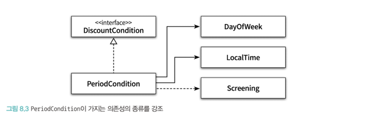
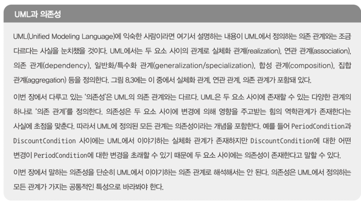
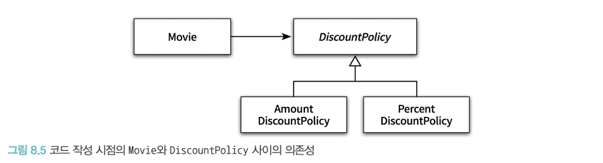
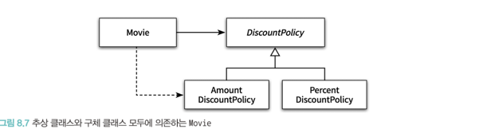
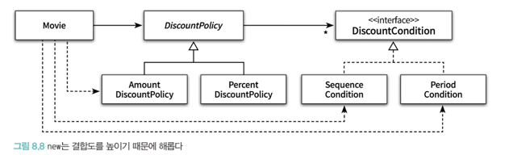

# 의존성 관리하기
# 목차
- [의존성 관리하기](#--------)
- [목차](#--)
    * [01. 의존성 이해하기](#01---------)
        + [변경과 의존성](#-------)
        + [의존성 전이](#------)
        + [런타임 의존성과 컴파일 타임 의존성](#-------------------)
        + [컨텍스트 독립성](#--------)
        + [의존성 해결하기](#--------)
    * [02. 유연한 설계](#02-------)
        + [의존성과 결합도](#--------)
        + [지식이 결합을 낳는다.](#-----------)
        + [추상화에 의존하라](#---------)
        + [명시적인 의존성](#--------)
        + [new는 해롭다.](#new-----)
        + [가끔은 생성해도 무방하다.](#-------------)
        + [표준 클래스에 대한 의존은 해롭지 않다.](#---------------------)
        + [컨텍스트 확장하기](#---------)
        + [조합 가능한 행동](#---------)

---

> 잘 설계된 어플리케이션은 작고 응집력 높은 객체들로 구성된다.
> 
> 작고 응집도 높은 객체는 명확한 목적을 가지고 있다.
> 
> 어플리케이션에서 객체가 단독으로 일하는 경우는 없고, 다른 객체와 협력 관계를 통해 일한다.

> 협력은 다른 객체를 알아야 하고 의존성을 갖게 하므로 과도한 협력은 설계를 힘들게 한다.

> 과도한 의존성은 어플리케이션의 수정을 어렵게 한다.
> 
> 그러므로 협력 관계에 있는 객체들에 변경을 방해하는 불필요한 의존성을 제거해야 한다.

---

## 01. 의존성 이해하기
### 변경과 의존성
한 객체가 역할을 수행하며 다른 객체의 도움을 받을 때, 우리는 의존성을 갖는다고 한다.

의존성은 구현 시점과 실행 시점에 따라 다른 의미를 갖는다.

> * 구현 시점 : 의존 대상 객체가 변경될 경우, 의존하는 객체도 함께 변경된다.
> * 실행 시점 : 의존하는 객체가 정상적으로 동작하기 위해서는 실행 시에 의존 대상 객체가 반드시 존재해야 한다.

코드를 통해 알아보자

~~~ java
    public class PeriodCondition implements DiscountCondition {
        private DayOfWeek dayOfWeek;
        private LocalTime startTime;
        private LocalTime endTime;
        
        ...
        
        public boolean isSatisfiedBy(Screening screening) {
            return screening.getStartTime().getDayOfWeek().equals(dayOfWeek) &&
            startTime.compareTo(screening.getStartTime().toLocalTime()) <= 0 &&
            endTime.compareTo(screening.tgetStartTime().toLocalTime()) >= 0; 
        } 
    }
~~~

1. PeriodCondition의 isSatisfiedBy가 실행되는 시점에 Screening 인스턴스가 반드시 존재해야한다.
   2. 실행 시점에 인스턴스가 존재하지 않거나 getStartTime 메시지를 이해할 수 없다면 올바르게 동작하지 않는다.
2. 의존성은 방향성을 가지며 호출 하는쪽에서 단 방향으로 갖는다.
   3. Screening이 변경되면 PeriodTime은 영향을 받지만 그 반대는 성립하지 않는다.
   

PeriodConditon은 DayOfWeek, LocalTime, DiscountCondition, screening에 의존성을 갖는다.

* DayOfWeek, LocalTime은 인스턴스 변수로 가지고 있다.
* DiscountCondition은 인터페이스를 제공하기 위해서 의존한다.
* Screening은 메서드의 인자로 사용된다.

어느 경우라도 대상이 변경되면 이들에 의존하는 PeriodCondition은 수정될 수 있다.

하지만 아래처럼 표기 법을 바꾸면 이들을 파악하는데 편리하다.

---

### 의존성 전이
Screening은 Movie, LocalDateTime, Customer에 의존한다는 사실을 알 수 있다.

PeriodCondition이 Screening에 의존하므로, Screening에 캡슐화 정도에 따라 PeriodCondition이 Screening이 가지고 있는 의존성에

의존할 수 있다. 하위 의존성에 의존성들에 잠재적으로 의존할 수 있는 것을 의존성 전이 라고 한다.

의존성은 직접 의존성과 간접 의존성으로 나눌 수 있고,

PeriodCondition이 Screening에 코드로 명시된 것처럼 명시적으로 드러나는 것을 직접 의존성이라 하고

간접 의존성은 PeriodCondition이 Screening에 의존성 전파에 의해 Screening이 가지는 의존성에 의존하는 것처럼 하위 의존성에 대한 의존성을 갖는 것을 말한다.

---

### 런타임 의존성과 컴파일 타임 의존성
런타임 의존성은 실행되는 시점의 의존성이고, 컴파일타임은 코드가 작성되는 시점, 혹은 코드 그 자체를 뜻한다.

객체지향 어플리케이션에서는 런타임의 주인공은 객체이다. 따라서 런타임 의존성이 다루는 주체는 객체 사이의 의존성이다.

중요한 것은 런타임과 컴파일 타임의 의존성이 다를 수 있다는 것이다.

Movie는 가격 계산을 위해 비율, 금액 할인 정책을 모두사용해야 한다. 

여기서 중요한 것은 Movie에서 Amount나 PercentDiscountPolicy로 직접 의존하는 것이 없다는 것이다.

하지만 런타임에는 특정 인스턴스에 의존하게 된다.

Movie는 각 할인정책객체를 알지 못하지만 실행 시점에는 협력할 수 있다.

특정 정책과 결합하면 변화에 영향을 받기 때문이고, 확장을 하려면 또 새로운 객체에 의존해야하기 때문이다.

Movie 클래스는 그래서 특정 객체에 의존하지 않고, 두 클래스를 포괄하는 개념에의존하고 런타임시에 두 객체와 협력한다.

> 핵심은 유연하고 자새용 가능한 설계를 하기 위해서는 동일한 소스코드로 실행 시 다양한 구조를 만들 수 있어야 한다는 것이다.
> 
> 협력 관계에서 협력할 인스턴스의 구체적인 클래스를 알아선 안된다. 실제 협력할 객체는 런타임에서 결정되어야 한다.

---

### 컨텍스트 독립성
유연하고 확장가능한 설계를 하려면 컴파일과 런타임 의존성이 달라야 한다는 사실을 알았다.

특정한 객체에 의존할때마다 해당 객체에 더 강하게 결합되기 때문이다.

클래스가 특정한 문맥에 강하게 결합될수록 다른 객체와 협력하기는 더 어려워진다.

내가 실행시킬 객체에 대해 문맥을 모를수록 사용하기 수월해진다. 이를 컨텍스트 독립성이라고 한다.

그런데 그러면 내가 실행할 객체에 대해 아는게 없는데 어떻게 뭔지 알고 협력을 할 수 있을까? 이게 말이나 되는 소리일까?

개소리 일수도 있을거같은데... 아래서 확인해보자

---

### 의존성 해결하기
컴파일 의존성은 런타임 의존성으로 대체되어야 한다.
Movie가 특정 인스턴스에 의존하고 있다면, 이를 포괄한 상위 개념에 의존하도록 변경하고 이 작업을 의존성 해결이라고 한다.
아래 방법이 나온다.

1. 생성자를 통해 의존할 객체를 주입 받기
2. Setter로 의존할 객체 정하기
3. 메서드 실행할 때 인자로 받기

생성자로 해도 나중에 바꿔야 해서 Setter가 필요하다.

Setter만 있으면 초기화가 안된 상태에서 동작하면 오류가 발생한다.

그래서 두 개를 합친다.

메서드 실행할때 순간에만 잠깐 의존해도 되는데 대부분 같은 객체에 의존하고 있다면 위 경우를 쓴다.

---

## 02. 유연한 설계
### 의존성과 결합도
위 예시처럼 협력하는 객체에 너무 자세한 내용까지 알면 결합도가 올라가고 유연하고 확장 가능한 설계에서 멀어진다.

---

### 지식이 결합을 낳는다.
많이 알수록 구체적인 것에 의존하게 된다. 그러면 결합도가 올라가게 된다. 요금, 비율 정책으로 영화의 가격을 계산하는 것 보다.

추상적인 개념에 의해서 Movie가 의존하게 된다면 메세지만 남기고 내부 구현이 어떻게 되는지는 몰라도 되고, 그렇게 되면 컨텍스트 독립성이 강해지고

결합도는 낮아진다.

---

### 추상화에 의존하라
협력하는 객체에 대해 적게알수록 결합도는 낮아지고, 적게 아는 방법은 추상화를 사용하는 것이다.

아래 방법들은 아래로 갈 수록 더 높은 추상화를 제공한다.

1. 구체 클래스 의존성
2. 추상 클래스 의존성
3. 인터페이스 의존성

어렵지 않다. 특정 구현된  클래스를 구체 클래스라고한다.

추상 클래스는 구체 클래스 보다 더 적은 정보를 제공하지만 클래스의 계층 관계를 알아야 하기 때문에 인터페이스 추상화가 더 높은 수준의 추상화이다.

> 핵심은 구체적인 클래스 > 추상클래스 > 인터페이스 순으로 많은 정보를 제공한다는 것이다. 이는 높은 결합도 가능성을 말한다.
> 

---

### 명시적인 의존성
아래 코드는 실수로 결합도가 불필요하게 높아졌다. 뭘까?

~~~
public class Movie {
    ...
    private DiscountPolicy discountPolicy;
    
    public Movie(String title, Duration runningTime, Money fee) {
        ...
       this.discountPolicy = new AmountPolicy(...);
    }
}
~~~

생성자에서 구체적인 클래스와 결합하고, 인스턴스 변수로 discountPolicy 이렇게 두 곳에 결합되어 있다.

단순히 인스턴스 변수에 인터페이스를 통해 결합되었다고 끝나는게 아니고 클래스 안에 구체 클래스에 대한 모든 의존성을 제거해야 한다.

이렇게 명시적으로 의존성이 보여지지 않는다면 내부 구현을 다 까봐야 한다.

---

### new는 해롭다.
new는 해롭지 않다. 해롭게 사용하는 방법을 알아보자.

1. new를 통해 인터페이스 생성이 안되니 구체적인 클래스를 생성해야 하는데 이는 강한 결합도를 나타낸다.
2. new는 의존하는 객체에서 뿐만 아니라 생성 자체에서도 어떤 인자를 넣어야 하는지 노출되므로 결합도를 높인다.

아래 예시를 보자

~~~java
public class Movie {
    private DiscountPolicy discountPolicy;
    
    public Movie(String title, Duration runingTime, Money fee) {
        ...
        this.discountPolicy = new AmountDiscountPolicy(Money.won(800),
                              new SequeuenceCondition(1),
                              new SequeuenceCondition(10),
                              ...
    }
}
~~~

Movie 클래스가 AmountDiscountPolicy 인스턴스를 생성하기 위해 전달되는 인자를 알고 있어야 하고, 

수 많은 인스턴스들이 생성자에 전달되며 그들의 의존성 역시 생겨난다.

그래서 높은 결합도를 피해야 하는 이유이다.

Movie가 DiscountPolicy를 알아야 하는 이유는 calculateDiscountAmount 메세지를 전송하기 위해서인데, 이를 위해

new를 쓰면, 객체 내부 생성자 인자가 뭐가 필요한지도 노출되고, 결합도도 인자들과 생겨난다.

어떻게 해야할까?

이미 알고있다. 생성자를 통해 주입받고, Setter를 만든다. 혹은 메서드 인자 값으로 전달 받는다.

> 사용과 생성을 분리하고, 의존성을 생성자에 명시적으로 드러내고, 구체 클래스가 아닌 추상 클래스에 의존하게 하여 설계를 유연하게 만들었다.
> 
> 출발은 객체 생성을 객체 내부가 아니라 의존하고 있는 클라이언트로 옮겼다.

---

### 가끔은 생성해도 무방하다.
클래스 안에서 인스턴스를 직접 생성하는 방식이 좋을 때도 있다.

주로 협력하는 기본 객체를 설정하고 싶은 경우가 여기에 속한다.

만약 AmountDiscountPolicy가 90% 이상 사용된다고 가정을 해보자.

이때 객체 생성을 클라이언트로 옮기면 중복코드가 늘어나고 Movie 클래스의 사용성이 나빠질 것이다.

> 이 문제를 해결하려면 기본 객체를 생성하는 생성자를 추가하고, DiscountPolicy의 인스턴스를 인자로 받는 생성자를 체이닝 하는 것이다.

~~~java 
pulic class Movie {
    private DiscountPolicy discountPolicy;
    
    public Movie(String title, Duration runningTime, Money fee) {
        this(title, runningTime, fee, new AmountDiscountPolicy(...));
    }
    
    public Movie(String title, Duration runningTime, Money fee, DiscountPolicy discountPolicy) {
        ...
        this.discountPolicy = discountPolicy;
    }
} 
~~~

메서드 레벨에서도 동일하게 사용할 수 있다. 하지만 이 모든건 사용성과 결합도의 트레이드 오프이다.

---

### 표준 클래스에 대한 의존은 해롭지 않다.
의존성이 불편한 이유는 변화에 대해 오염이 되서 겷합된 클래스가 영향을 받기 때문이다. 

하지만 표준 클래스는 변경될 확률이 거의 없어서 괜찮다.

예를 들어 ArrayList가 있다.

~~~java
public abstract class DiscountPolicy {
    private List<DiscountCondition> conditions = new ArrayList<>();
}
~~~

위 코드에서 추가로 List를 추상화 타입으로 쓴 것은 확장성 측면에서 유리하기 때문이다.

---

### 컨텍스트 확장하기
Movie의 설계는 유연하고 재사용 가능하단 이유를 설명했다.

두 가지를 통해 확인해보자.

1. 할인 혜택이 없는 영화의 예매 요금 계산
2. 다수의 할인 정책을 중복 해서 처리하는 계산

첫 번째는 쉽게 생각하면 discountPolicy에 아무것도 할당하지 않는 것이다.

~~~java
public class Movie {
    public Movie(String title, Duration runningTime, Moneyfee) {
        this(title, runingTime, fee, null);
    }

    public Movie(String title, Duration runningTime, Moneyfee, DiscountPlolicy discountPlolicy) {
        ...
    }
    
    public Money calculateMovieFee(Screening screening) {
        if (discountPolicy == null) {
            return fee;
        }
        
        ...
    }
}
~~~

앞서 설명한 개념처럼 생성자 체이닝을 통해 기본값을 null로 주고 있고, calculateMovieFee에서 이를 체크하고 있다.

재대로 동작하지만 지금까지 movie와 discountPolicy가 협력하는 방식이 바뀌었기 때문에 Movie에 calculateMovieFee 메서드가

변경되었다.

어떤 경우든 내부 코드가 수정되면 버그 가능성이 높아진다.

위 케이스는 확장에서 기존 코드의 수정이 일어난 케이스이다.

> 해결방법은 기존처럼 협력하던 방식을 유지하는 것이다. 할인 정책이 존재하지 않는다는 것을 예외 처리하지말고, 이를 하나의 구현체로 개발하는 것이다.

~~~java
public class NoneDiscountPolicy extends DiscountPolicy {
    @Override
    protected Money getDiscountAmount(Screening screening) {
        return Money.Zero;
    }
}
~~~

이제 간단하게 if문을 추가하지 않고도 할인 혜택을 제공하지 않는 영화를 구현할 수 있다.

클라이언트는 영화 생성 시, NoneDiscountPolicy를 생성자에 전달하면 된다.

두 번째는 중복된 할인 정책을 가진 영화를 만드는 것이다.

위와 동일하게 추상화를 통해 추상클래스를 확장하여 동일한 메세지를 처리할 수 있게 오버라이드 하고, 클라이언트에서는 동일하게 사용되게 한다.

~~~java
public class OverlappedDiscountPolicy {
    private List<DiscountPolicy> discountPolicies = new ArrayList<>();
    
    public OverlappedDiscountPolicy(DiscountPolicy ... discountPolicies) {
        this.discountPolicies = Arrays.asList(discountPolicies);
    }
    
    @Override
    protected Money getDiscountAmount(Screeining screeining) {
        ...
        for(DiscountPolicy each : discountPolicies) {
            ...
        }
    }
}
~~~

---

### 조합 가능한 행동
다양한 종류의 할인 정책이 필요한 컨텍스트에서 Movie를 재사용 할 수 있는 이유는 코드를 직접 수정하지 않고 협력 대상인

DiscountPolicy의 인스턴스를 교체할 수 있었기 때문이다.

어떤객체와 협력하느냐에 따라 객체의 행동이 달라지는 것은 유연하고 재사용이 가능한 설계가 가진 특징이다.

유연하고 재사용 가능한 설계는 How가 아닌 What을 하는지를 표현하는 클래스로 구성된다.

